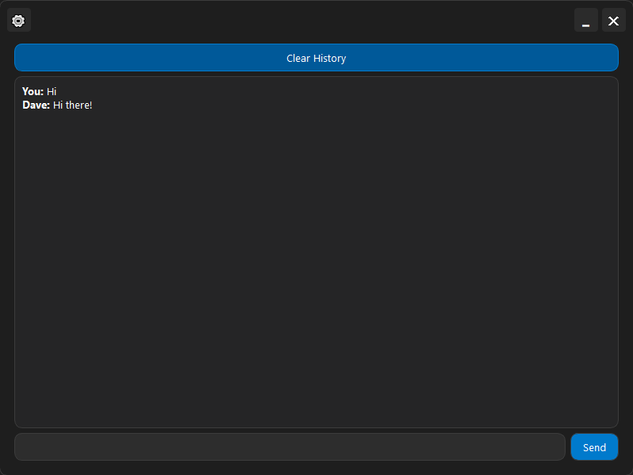

# Dave - Moderne Chat-Anwendung

[](https://opensource.org/licenses/MIT)
[](https://www.python.org/downloads/)
[](https://pypi.org/project/PyQt5/)
[](https://github.com/psf/black)
[](https://ollama.com)

Dave ist eine moderne Chat-Anwendung mit mehrsprachiger Unterstützung und anpassbarer Benutzeroberfläche. Die Anwendung nutzt Ollama für die Antwortgenerierung und bietet eine benutzerfreundliche Schnittstelle für die Interaktion mit KI.



## ✨ Funktionen

- 🎨 Moderne Benutzeroberfläche
- 🌐 Mehrsprachige Unterstützung (English, Русский, Deutsch)
- 🌓 Hell- und Dunkelmodus
- 💾 Chat-Verlauf speichern
- ⚙️ Anpassbare Anzeigeoptionen
- 🤖 Ollama KI-Integration


## 🚀 Anforderungen

- Python 3.7+
- PyQt5
- [Ollama](https://ollama.com/download) - muss separat installiert werden
- Weitere Abhängigkeiten sind in requirements.txt aufgeführt

## 📦 Installation

1. Installieren Sie [Ollama](https://ollama.com/download) für Ihr Betriebssystem

2. Klonen Sie das Repository:
```bash
git clone https://github.com/kigg-dev/Ai-Dave.git
cd Ai-Dave
```

3. Installieren Sie die Abhängigkeiten:
```bash
pip install -r requirements.txt
```

4. Starten Sie die Anwendung:
```bash
python main.py
```

## 💡 Verwendung

1. **Chat**:
   - Geben Sie eine Nachricht in das Eingabefeld ein
   - Drücken Sie "Send" oder Enter zum Senden
   - Der Chat-Verlauf wird automatisch gespeichert

2. **Einstellungen**:
   - Klicken Sie auf das ⚙️-Symbol für die Einstellungen
   - Wählen Sie Ihre bevorzugte Sprache
   - Wechseln Sie zwischen Hell- und Dunkelmodus
   - Passen Sie weitere Anzeigeoptionen an

3. **Verlauf verwalten**:
   - Nutzen Sie "Clear History" zum Löschen des Chat-Verlaufs
   - Der Verlauf wird zwischen Sitzungen gespeichert

## 🤝 Projektbeitrag

Wir freuen uns über Ihre Beiträge zum Projekt! Bitte:

1. Erstellen Sie einen Fork des Repositories
2. Erstellen Sie einen Branch für Ihre Änderungen
3. Reichen Sie Ihre Änderungen als Pull Request ein

## 📝 Lizenz

Veröffentlicht unter der MIT-Lizenz. Weitere Informationen finden Sie in der [LICENSE](LICENSE)-Datei.

## 🙏 Danksagungen

- [Ollama](https://ollama.com) für die KI-Funktionalität
- [PyQt](https://riverbankcomputing.com/software/pyqt/) für das GUI-Framework

## 📞 Kontakt & Support

- 🐛 Fehler gefunden oder Vorschläge? Kontaktieren Sie mich auf Telegram: [@Ubotc](https://t.me/Ubotc)
- 📢 Folgen Sie meinem Entwicklungs-Kanal: [KiggDev](https://t.me/KiggDev)
