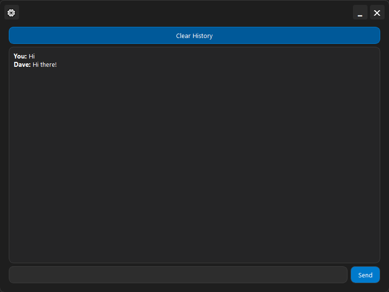
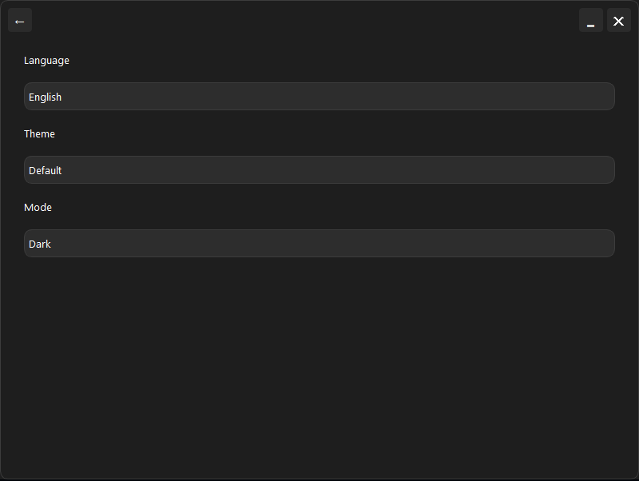

# Dave - Modern Chat Application

[English](README.md) | [Русский](README.ru.md) | [Deutsch](README.de.md)

[](https://opensource.org/licenses/MIT)
[](https://www.python.org/downloads/)
[](https://pypi.org/project/PyQt5/)
[](https://github.com/psf/black)
[](https://ollama.com)

Dave is a modern chat application with multilingual support and customizable interface. The application uses Ollama for response generation and provides a user-friendly interface for interacting with AI. Dave is designed to help users perform various tasks on their PC, such as file creation, file searching, system management, and other automated operations through natural language commands.



## ✨ Features

- 🎨 Modern user interface
- 🌐 Multilingual support (English, Русский, Deutsch)
- 🌓 Light and dark themes
- 💾 Chat history saving
- ⚙️ Customizable display settings
- 🤖 Ollama AI integration



## 🚀 Requirements

- Python 3.7+
- PyQt5
- [Ollama](https://ollama.com/download) - requires separate installation
- Additional dependencies listed in requirements.txt

## 📦 Installation

1. Install [Ollama](https://ollama.com/download) for your operating system

2. Clone the repository:
```bash
git clone https://github.com/kigg-dev/Ai-Dave.git
cd Ai-Dave
```

3. Install dependencies:
```bash
pip install -r requirements.txt
```

4. Run the application:
```bash
python main.py
```

## 💡 Usage

1. **Chat**:
   - Enter your message in the input field
   - Press "Send" or Enter to send
   - Chat history is automatically saved

2. **Settings**:
   - Click the ⚙️ button to access settings
   - Choose your preferred interface language
   - Switch between light and dark themes
   - Configure additional display settings

3. **History Management**:
   - Use "Clear History" button to clear chat history
   - History is preserved between sessions

## 🤝 Contributing

We welcome your contributions to the project! Please:

1. Fork the repository
2. Create a branch for your changes
3. Submit your changes as a pull request

## 📝 License

Released under the MIT License. See the [LICENSE](LICENSE) file for details.

## 🙏 Acknowledgments

- [Ollama](https://ollama.com) for providing AI functionality
- [PyQt](https://riverbankcomputing.com/software/pyqt/) for the GUI framework

## 📞 Contact & Support

- 🐛 Found a bug or have a suggestion? Contact me on Telegram: [@Ubotc](https://t.me/Ubotc)
- 📢 Follow my development channel: [KiggDev](https://t.me/KiggDev)
